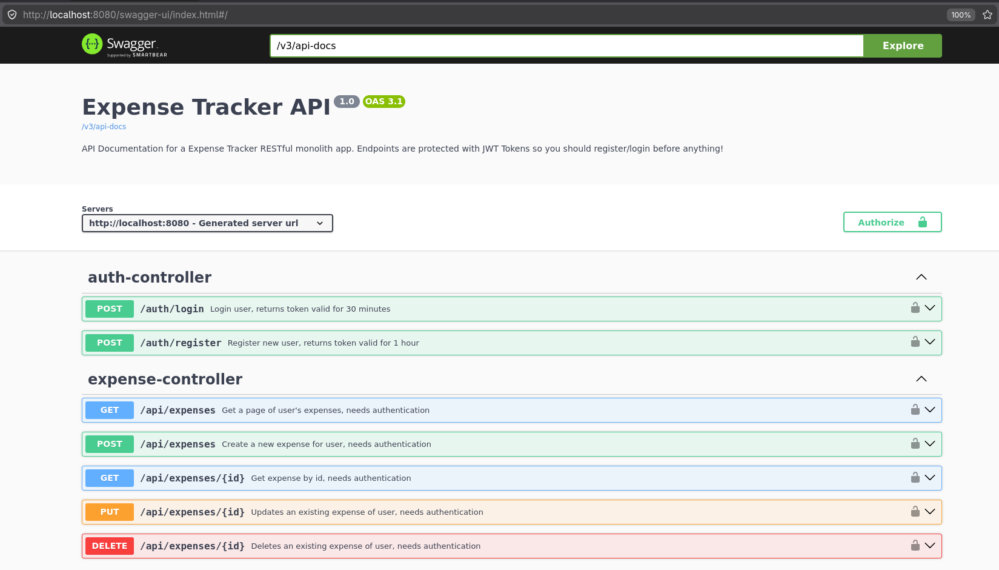

# 💸 Expense Tracker API

[← Back to Roadmap Projects](../README.md)

A feature-rich REST API for financial tracking, built with Spring Boot, PostgreSQL, and SpringDoc Swagger.

## 🌟 Highlights

- **JWT-Secured CRUD:** Secure, authenticated expense management with user-specific data isolation.
- **Advanced Filtering & Pagination:** Implements `Pageable` and custom JPA Specifications for efficient expense querying.
- **Swagger UI Documentation:** Complete API documentation generated via **SpringDoc OpenAPI** (available at `/swagger-ui.html`).
- **Data Persistence:** Relational database management using PostgreSQL.
- **Resilient Error Handling:** Global exception handling with structured error responses.

## ℹ️ Project Context

This project focuses on **API Documentation** and **Production-Ready REST Standards**. I built this to master the implementation of OpenAPI (Swagger) documentation, ensuring that every endpoint is well-documented with appropriate request/response schemas and status codes. It served as a sandbox for learning pagination, filterable queries, and robust API security.

## 🚀 Usage

### 1. Requirements

- Docker
- Docker Compose
- Java 21

### 2. Run the Application

```bash
# Clone the repository
git clone https://github.com/massemiso/roadmap-projects
cd roadmap-projects/expense-tracker-api

# Spin up the infrastructure and application
docker-compose up --build
```

The API will be available at `http://localhost:8080`, and the **Swagger UI** documentation is accessible at `http://localhost:8080/swagger-ui.html`.



## 📋 API Endpoints

### Authentication

| Endpoint         | Method | Status Codes                                             | Description                                |
| :--------------- | :----- | :------------------------------------------------------- | :----------------------------------------- |
| `/auth/login`    | POST   | 200 OK, 400 Bad Request, 401 Unauthorized, 404 Not Found | Login user and generate JWT Token          |
| `/auth/register` | POST   | 201 Created, 400 Bad Request, 409 Conflict               | Register a new user and generate JWT Token |

### Expenses

| Endpoint             | Method | Status Codes                                             | Description                                  |
| :------------------- | :----- | :------------------------------------------------------- | :------------------------------------------- |
| `/api/expenses`      | GET    | 200 OK, 401 Unauthorized                                 | Retrieve paged list of expenses with filters |
| `/api/expenses/{id}` | GET    | 200 OK, 401 Unauthorized, 404 Not Found                  | Retrieve a specific expense                  |
| `/api/expenses`      | POST   | 201 Created, 400 Bad Request, 401 Unauthorized           | Create a new expense                         |
| `/api/expenses/{id}` | PUT    | 200 OK, 404 Not Found, 400 Bad Request, 401 Unauthorized | Update an existing expense                   |
| `/api/expenses/{id}` | DELETE | 204 No Content, 401 Unauthorized, 404 Not Found          | Delete an expense                            |

## 🛠️ Technical Architecture

- **Security:** JWT-based stateless authentication.
- **API Docs:** Integrated `springdoc-openapi` for real-time Swagger UI updates.
- **Querying:** JPA Specifications for dynamic filtering (`Pageable` support).
- **Validation:** Server-side `jakarta.validation` on all request DTOs.

## 🧪 Testing & Quality

- **Unit Testing:** Focuses on business logic, mappers, and custom filters.
- **Integration Testing:** Uses **Testcontainers** for PostgreSQL to ensure real database compatibility.

```bash
./mvnw clean test
```

## 🧠 Key Learnings

- **SpringDoc OpenAPI:** Automating API documentation to improve developer experience (DX).
- **Pageable/Specification:** Building production-grade list endpoints that don't crash when thousands of records are added.
- **REST Best Practices:** Returning correct HTTP status codes (201 Created, 204 No Content) for standard operations.
- **Security:** Managing authenticated user contexts within a stateless API.

---

[← Back to Roadmap Projects](../README.md)
