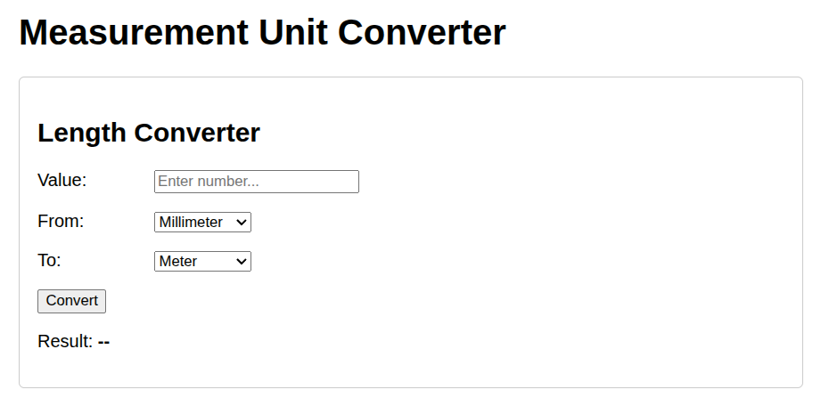

# 📏 Unit Converter

[← Back to Roadmap Projects](../README.md)

A simple web-based unit converter proposed by [roadmap.sh](https://roadmap.sh/projects/unit-converter)

## 🌟 Highlights

- **Hub-and-Spoke Model:** Implements a centralized conversion strategy where all units are converted to a base SI unit, then to the target unit, ensuring clean and scalable logic.
- **Full-Stack Implementation:** Built with a Go backend and a vanilla JavaScript frontend, handling requests via REST API.
- **RESTful API:** Exposes a clean POST endpoint for unit conversions, decoupled from the frontend presentation layer.
- **CORS Support:** Properly handles cross-origin requests to allow seamless communication between the browser and the Go server.
- **Pure Go:** Backend built using only the Go Standard Library with zero external dependencies.

## ℹ️ Project Context

This project was built to practice integrating a **Go backend** with a **Frontend web interface**.

The goal was to move beyond CLI-only tools and implement a client-server architecture. It served as a sandbox for handling HTTP requests, JSON serialization in Go, and addressing cross-origin resource sharing (CORS) in a browser-based application.

## 🚀 Usage

### 1. Start the Backend

```bash
cd backend
go run .
# Server will start on http://localhost:8080
```

### 2. Run the Frontend

Open `frontend/index.html` in your web browser. The application will automatically communicate with the local server to perform conversions.



## 🛠️ Technical Architecture

- **Layered Architecture:**
  - **Frontend:** HTML/JS handles DOM events and form submission.
  - **Backend:** Go server acts as a RESTful controller, performing calculations in a separate `conversion.go` layer.
- **Conversion Strategy:** A map-based lookup table system for scaling easily to new units without complex `if/else` ladders.
- **Request/Response:** Standardized JSON request structures ensuring type safety and easy parsing.

## 🧠 Key Learnings

Building this project helped me understand:

- **Client-Server Communication:** Moving data between a browser and a backend via `fetch` and JSON.
- **CORS & Preflight Requests:** Understanding the browser security model and how to properly configure Go handlers for `OPTIONS` requests.
- **RESTful API Design:** Designing clean, dedicated endpoints (`POST /api/convert`) for logical operations.
- **Separation of Concerns:** Keeping conversion logic (math) completely separate from HTTP handler logic.

---

[← Back to Roadmap Projects](../README.md)
